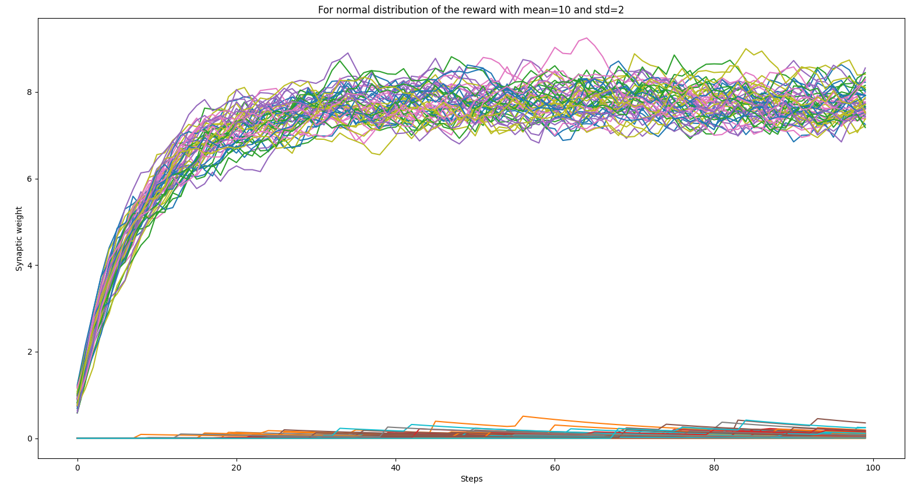
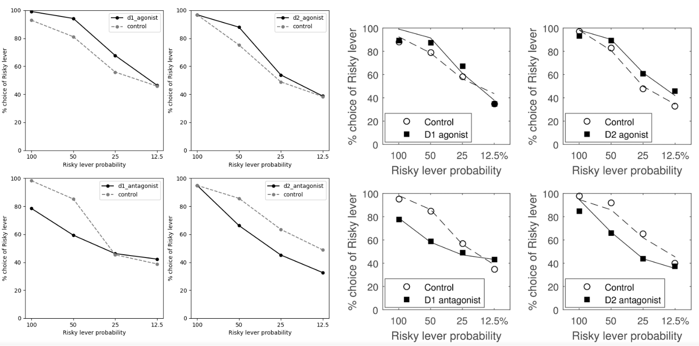

Implementation of the paper: Mikhael, J. G. & Bogacz, R. Learning Reward Uncertainty in the Basal Ganglia. 
PLoS Comput. Biol. (2016). https://doi:10.1371/journal.pcbi.1005062

## make_fig2_au.py
Replicates fig. 2 from the paper: train Actor Uncertainty Model with detrministic reward.

#### Parameters:
* MEAN - mean of the reward distribution
* STD - standard deviation of the reward distribution

#### 50 trials of GO/NO-GO adjustment to the reward for actor only (no critic):


* G (GO population) - all upper curves
* N (NO-GO population) - all lower curves

## train_au_with_deterministic_reward.py
Training example of Actor Uncertainty Model with detrministic reward.

* EPOCH - number of epochs 
* REWARD - integer representing expected reward (here it is deterministic)
* ACTOR_ONLY - if true model will not use critic and 
* STATE_AND_ACTION_NUM - number of states and actions (same number here).
  If actor choose: 
  * action=0 in state=0 -> reward
  * action=1 in state=1 -> reward
  * action=1 in state=0 -> -reward
  
Returns Probability matrix with highest probabilities on diagonal (which is the expected outcome)

#### Example of the matrix for STATE_AND_ACTION_NUM=4, BATCH_NUM=100, REWARD=1:
```
[0.415126880851062, 0.19495770638297932, 0.19495770638297932, 0.19495770638297932]
[0.18563139548871202, 0.40773597674796314, 0.2033163138816624, 0.2033163138816624]
[0.1883143045894067, 0.1883143045894067, 0.41711656975760747, 0.20625482106357915]
[0.19061311338016393, 0.19061311338016393, 0.19061311338016393, 0.4281606598595082]
```

## train_au_with_uncertain_reward.py
Replication of the fig. 5 of the paper: train Actor Uncertainty Model with uncertain reward.

Reward have been set to:
 * 1 (AU) for safe reward 
 * 4 (AU) for risky reward
 
Those assumptions based on the publication:
"risky lever gave higher expected reward in the 100% and 50% conditions while choosing the safe 
lever had higher mean reward in the 12.5% condition"

You can manipulate parameters to change agent's preferences of choosing risky/non-risky reward. 
In general if (b-a) is bigger - preference for risk choosing is higher

#### Params:
* EPOCH - number of epochs 
* REWARD - integer representing expected reward (here it is deterministic)
* ACTOR_ONLY - if true model will not use critic and 
* SAFE_REWARD - value of safe reward
* RISK_REWARD - value of risk reward
* RISK_REWARD_PROBA - probability of getting reward when choosing risk option

You can also manipulate A, B params for DA agonist/antagonist in D1 (A param) and/or D2 (B param).
A_CONT and B_CONT stands for A and B control conditions and if you want to use them - you need to
override A or B params respectively.

#### Replication of fig. 5 from the paper

* Left: replication of fig. 5 from averaged 10 runs of 10000 steps:
* Right: original fig. 5 from the publication:
